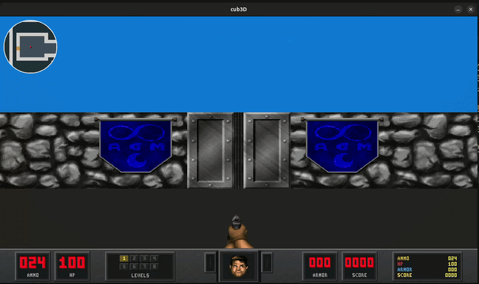

# cub3D

[](https://github.com/dbouizem/cub3D)
[](https://en.wikipedia.org/wiki/C_(programming_language))
[](https://harm-smits.github.io/42docs/libs/minilibx)
[](https://lodev.org/cgtutor/raycasting.html)
[](https://github.com/42School/norminette)
[](#)
[](LICENSE)


> Raycasting engine inspired by Wolfenstein 3D.
 First-person 3D renderer from a 2D .cub map, built on MiniLibX/X11.  [Full documentation](https://cub3d.djihane-bouizem.workers.dev/en/)



---
## Table des matières

1. [Features](#features)
2. [Map format](#map-format)
3. [Build and run](#build-and-run)
4. [Controls](#controls)
5. [Architecture](#architecture)
6. [Bonus architecture](#bonus-architecture)
7. [Bonus render flow](#bonus-render-flow)
8. [Map characters](#map-characters)
9. [Door tiles](#door-tiles)
10. [Sprite and pickup tiles](#sprite-and-pickup-tiles)
11. [Animated walls](#animated-walls)
12. [Static wall texture mapping](#static-wall-texture-mapping)
13. [Adding a new bonus tile](#adding-a-new-bonus-tile)
14. [Test suite](#test-suite)
15. [Verification](#verification)
16. [Development rules](#development-rules)
17. [Project organization](#project-organization)
18. [Resources](#resources)
19. [Authors](#authors)

---

## Features

### Mandatory

- DDA raycasting with one texture per wall direction (`NO`, `SO`, `WE`, `EA`)
- `.cub` parser — strict identifier, RGB, texture path, and map validation
- Player spawn parsing for `N`, `S`, `E`, `W` orientations
- Frame-delta smooth movement and rotation
- Wall collision
- Clean exit on `ESC` and window close button

### Bonus

- Retro render pipeline with resolution presets
- Minimap with zoom
- Doors — state tracking, collision, interaction
- Pickups — health, ammo, armor, score
- Animated sprites and walls (3–4 frame sequences)
- Weapon and HUD overlay
- Multiple bonus wall tile sets across 6 level themes
- Level switching at runtime

---

## Map format

The program expects exactly one argument: a file ending in `.cub`.

Mandatory identifiers can appear in any order before the map:

```
NO ./textures/mandatory/no.xpm
SO ./textures/mandatory/so.xpm
WE ./textures/mandatory/we.xpm
EA ./textures/mandatory/ea.xpm
F 30,30,30
C 180,180,220
111111
100001
10N001
111111
```

Mandatory configuration rules:

- `NO`, `SO`, `WE`, `EA` define readable `.xpm` wall textures.
- `F` and `C` define floor and ceiling RGB colors in the `[0,255]` range.
- The map must be the last block in the file.
- The map accepts `0`, `1`, spaces, and one player start among `N`, `S`, `E`, `W`.
- Spaces are part of the map and are validated as void outside playable cells.
- The map must be closed by walls.
- Any invalid identifier, duplicate key, invalid RGB value, invalid texture path, missing player, multiple players, open map, or trailing garbage causes `Error` followed by an explicit message.

---

## Build and run

### Requirements

- Linux (X11)
- `cc`
- `make`

### Build

```bash
make
make bonus
```

### Run

```bash
./cub3D maps/mandatory/map.cub
./cub3D maps/mandatory/maze.cub
./cub3D tests/mandatory/validation/good.cub
./cub3D tests/mandatory/render/box_n.cub
./cub3D_bonus tests/bonus/retro_small.cub
./cub3D_bonus maps/bonus/level1.cub
./cub3D_bonus maps/bonus/all_maps.cub
```

`maps/` contains playable maps. `tests/` contains correction-oriented maps for parser, validation, initialization, and render checks.

### Useful commands

```bash
make test
make test_bonus
norminette srcs include
norminette srcs include libft
norminette srcs include libft srcs_bonus
valgrind --track-origins=yes --leak-check=full --track-fds=yes ./cub3D maps/mandatory/map.cub
```

---

## Controls

### Mandatory

| Key | Action |
|-----|--------|
| `ESC` | Close the program |
| `W` / `Z` | Move forward |
| `S` | Move backward |
| `A` / `Q` | Strafe left |
| `D` | Strafe right |
| `Left Arrow` | Rotate left |
| `Right Arrow` | Rotate right |
| Red cross | Quit cleanly |

### Bonus

| Key | Action |
|-----|--------|
| Mouse move | Mouse look |
| Mouse wheel | Minimap zoom |
| `E` | Interact with doors |
| `Space` | Fire weapon |
| `F1`, `F2`, `F3` | Resolution presets |
| `F4` | Load next bonus level |

### Full keycode reference

The project uses Linux/X11 MLX keycodes from `include/defines.h`.

| Key | Macro | Use |
|-----|-------|-----|
| `ESC` | `KEY_ESC` | Close the program |
| `W` / `Z` | `KEY_W`, `KEY_Z` | Move forward |
| `S` | `KEY_S` | Move backward |
| `A` / `Q` | `KEY_A`, `KEY_Q` | Strafe left |
| `D` | `KEY_D` | Strafe right |
| `Left` | `KEY_LEFT` | Rotate left |
| `Right` | `KEY_RIGHT` | Rotate right |
| `E` | `KEY_E` | Interact with a door |
| `Space` | `KEY_SPACE` | Fire weapon in bonus mode |
| `F1`, `F2`, `F3` | `KEY_F1`, `KEY_F2`, `KEY_F3` | Resolution presets |
| `F4` | `KEY_F4` | Load next bonus level |
| Mouse move | `EVENT_MOUSEMOVE` | Mouse look |
| Scroll up/down | `BUTTON_SCROLL_UP`, `BUTTON_SCROLL_DOWN` | Minimap zoom |

---

## Architecture

```
srcs/           mandatory — parsing, raycasting, rendering, hooks, core
srcs_bonus/     bonus-only systems
  retro/        render target, minimap, wall rules, animated walls, shading
  hud/          face state, weapon overlay, status bar, glyph drawing
  sprites/      storage, sorting, projection, shadow, texture, render
  pickups/      discovery, updates, stat effects, sprite conversion
  doors/        discovery, state, collision, interaction
  levels/       level list, path lookup, reload, texture transfer, cleanup
  noop/         mandatory-build fallbacks for bonus APIs
include/        shared headers, bonus constants, structs, prototypes
tests/          parser and render validation maps
maps/           playable .cub maps
textures/       XPM assets — mandatory and bonus
libft/
minilibx/
docs/
```

Mandatory mode stays isolated through no-op fallbacks in `srcs_bonus/noop/`. `make bonus` replaces those with the real bonus modules.

---

## Bonus architecture

The bonus build uses:

- a dedicated retro render pipeline,
- a grouped bonus context inside `t_app`,
- a modular minimap renderer,
- bonus door state/query helpers,
- a separate bonus smoke-test suite.

### Key bonus integration files

- `include/defines_bonus.h` — all bonus constants: map alphabets, wall/door texture paths, minimap values, shading values, pickup stats, weapon timing, and HUD settings.
- `include/structs_bonus.h` — bonus runtime state grouped under `app->bonus`.
- `include/cub3d_bonus.h` — bonus function prototypes grouped by subsystem.
- `Makefile` — `BONUS_SRCS` lists real bonus modules. `BONUS_NOOP_SRCS` lists mandatory fallbacks. `BONUS_REPLACE_SRCS` removes those fallbacks for `make bonus`.

---

## Bonus render flow

```
draw_frame()
  update timing + input
  update doors, HUD state, pickups
  retro_begin()            swap frame to retro output buffer
  draw_background()
  raycast_scene()
  bonus_draw_sprites()
  bonus_draw_minimap()
  apply_world_vignette()
  retro_render()           restore normal frame pointer
  bonus_draw_hud()         drawn last — stays sharp at full resolution
  mlx_put_image_to_window()
```

---

## Map characters

### Mandatory

| Character | Meaning |
|-----------|---------|
| `0` | Empty floor |
| `1` | Mandatory wall |
| space | Void outside the map |
| `N`, `S`, `E`, `W` | Player start and orientation |

### Bonus

| Constant | Characters | Meaning |
|----------|------------|---------|
| `BONUS_DOOR_SET` | `AD` | Door-capable bonus tiles |
| `BONUS_PLAYER_SET` | `NSEW` | Player start and orientation |
| `BONUS_WALL_SYMBOL_SET` | punctuation symbols | Bonus symbol wall tiles |
| `BONUS_SPRITE_SET` | `*@)/` | Bonus sprites and pickups |

Numeric bonus wall tiles are `2` to `9`. Player detection still uses only `N`, `S`, `E`, `W` through `is_open_cell()` and `find_player()`.

---

## Door tiles

Door characters are listed in `BONUS_DOOR_SET`. Door state is tracked in `app->bonus.doors` so doors can animate and change collision state over time.

| Door tile | Texture |
|-----------|---------|
| `A` | `BONUS_DOOR_A_XPM` |
| all other supported door letters | `BONUS_DOOR_DEFAULT_XPM` fallback |

Door systems live in `srcs_bonus/doors/`.

---

## Sprite and pickup tiles

Sprite characters are listed in `BONUS_SPRITE_SET`.

| Character | Role |
|-----------|------|
| `*` | Health pickup |
| `@` | Ammo pickup |
| `)` | Armor pickup |
| `/` | Animated score pickup |

Pickup data is managed in `srcs_bonus/pickups/`. Sprite arrays and drawing live in `srcs_bonus/sprites/`.

---

## Animated walls

| Tile | Frames | Texture macros |
|------|--------|----------------|
| `o` | 3 | `BONUS_WALL_O1_XPM` to `BONUS_WALL_O3_XPM` |
| `p` | 3 | `BONUS_WALL_P1_XPM` to `BONUS_WALL_P3_XPM` |
| `q` | 3 | `BONUS_WALL_Q1_XPM` to `BONUS_WALL_Q3_XPM` |
| `*` | 4 | `BONUS_WALL_STAR1_XPM` to `BONUS_WALL_STAR4_XPM` |
| `.` | 4 | `BONUS_WALL_DOT1_XPM` to `BONUS_WALL_DOT4_XPM` |
| `(` | 4 | `BONUS_WALL_LPAREN1_XPM` to `BONUS_WALL_LPAREN4_XPM` |

Animation timing is configured by `BONUS_ANIM_*_FPS` macros. Loading is in `srcs_bonus/retro/walls_anim_io.c`, frame picking in `srcs_bonus/retro/walls_anim_pick.c`.

---

## Static wall texture mapping

| Group | Tiles | Texture family |
|-------|-------|----------------|
| Level 1 stone | `2` to `7` | `textures/bonus/walls/wall_s/` |
| Level 2 area | `g` to `n` | `textures/bonus/walls/wall_a/` |
| Level 3 gray symbols | `!` `"` `#` `$` `%` `&` | `textures/bonus/walls/wall_g/` |
| Level 4 tech | `d` `e` `f` | `textures/bonus/walls/wall_t/` |
| Level 5 computer | `+` `,` `-` | `textures/bonus/walls/wall_c/` |
| Level 6 marble | `r` to `z` | `textures/bonus/walls/wall_m/` |
| Level 7 flesh | `'` | `textures/bonus/walls/wall_f/` |
| Level 8 exit | `8` `9` `a` `b` `c` | `textures/bonus/walls/wall_e/` |
| Fallback symbols | other accepted punctuation | `BONUS_WALL_DEFAULT_XPM` |

Wall path table initialization is in `srcs_bonus/retro/walls_paths.c`. Texture loading is in `srcs_bonus/retro/walls_io.c` and `srcs_bonus/retro/walls_symbol_io.c`.

---

## Adding a new bonus tile

When adding a new bonus map tile, update in this order:

1. Add or update the character set in `include/defines_bonus.h`.
2. Add texture macros in `include/defines_bonus.h`.
3. Update the relevant path table in `srcs_bonus/retro/walls_paths.c` or symbol loading in `srcs_bonus/retro/walls_symbol_io.c`.
4. Update solid/valid rules in `srcs_bonus/retro/walls_rules.c`.
5. Update pickers under `srcs_bonus/retro/` if the tile is animated or special.
6. Add a parser/validation test map if the tile changes map validity.

Keep the mandatory build isolated: if mandatory code needs to call a bonus API, there must be a no-op fallback under `srcs_bonus/noop/`.

---

## Test suite

| Suite | Checks |
|-------|--------|
| `tests/mandatory/parser/` | header order, missing/duplicate keys, RGB parsing, unknown identifiers, bad texture paths |
| `tests/mandatory/validation/` | player count, invalid chars, open maps, spaces, trailing garbage |
| `tests/mandatory/init/` | texture loading, RGB boundaries |
| `tests/mandatory/render/` | orientation maps, floor/ceiling colors |
| `tests/mandatory/edge/` | rejection of bonus-only symbols in mandatory mode |
| `tests/bonus/` | retro dimensions, bonus wall tiles |

---

## Verification

Run before evaluation:

```bash
norminette include srcs srcs_bonus
make
make bonus
make test
make test_bonus
```

`make test_bonus` accepts `mlx_init failed` as a valid parse/init path in headless environments — parser checks still run. For MiniLibX/X11 runs, Valgrind may report one uninitialized byte inside `mlx_int_anti_resize_win` from MiniLibX internals. The relevant result is the heap summary — a clean run ends with `All heap blocks were freed`.

---

## Development rules

- Keep mandatory behavior independent from bonus internals.
- Add new bonus logic under `srcs_bonus/<feature>/`.
- Do not add `_bonus.c` files inside `srcs/`.
- Keep shared bonus state inside `app->bonus`.
- Prefer small files grouped by responsibility over large files split only by norminette pressure.
- Avoid global variables — use local path tables or small initializer functions.
- Keep comments useful: document subsystem purpose, not obvious assignments.

---

## Project organization

| Issue | Owner | Related phases | Branch |
|-------|-------|----------------|--------|
| Issue 1 — `.cub` file reading and config parsing | A + B | Phase 0: Architecture · Phase 1: Setup · Phase 2: Config parsing | `1-parsing-cub-file` |
| Issue 2 — Full map extraction and validation | B | Phase 3: Map validation | `2-map-validation` |
| Issue 3 — Game and MiniLibX initialization | A | Phase 4: MLX + Textures | `3-mlx-init` |
| Issue 4 — Player system and input handling | B | Phase 5: Player system | `4-player-inputs` |
| Issue 5 — Ray-casting implementation | A | Phase 6: Raycasting | `5-raycasting` |
| Issue 6 — Final rendering with textures, floor, ceiling | B | Phase 7: Textured render | `6-textured-render` |
| Issue 7 — Errors, cleanup, tests, and polishing | A + B | Phase 8: Polish | `7-polish` |

---

## Resources

- [Lode Vandevenne — Raycasting Guide](https://lodev.org/cgtutor/raycasting.html)
- [3DSage — Raycasting Tutorial Part 1](https://www.youtube.com/watch?v=gYRrGTC7GtA)
- [3DSage — Raycasting Tutorial Part 2](https://www.youtube.com/watch?v=fRu8kjXvkdY)
- [3DSage — Raycasting Tutorial Part 3](https://www.youtube.com/watch?v=w0Bm4IA-Ii8)
- [3DSage — Raycasting Tutorial Part 4](https://www.youtube.com/watch?v=8j0gakEHJuI)
- [MiniLibX Documentation](https://harm-smits.github.io/42docs/libs/minilibx)
- [MiniLibX Linux Repository](https://github.com/42Paris/minilibx-linux)
- [Wikipedia — Ray casting](https://en.wikipedia.org/wiki/Ray_casting)

---

## Authors

[](https://github.com/dbouizem)
[](https://github.com/Basurita-Bebe)

> AI was used as an assistant for proposing refactors, generating edge-case ideas for parser/map validation tests, reviewing movement/collision robustness, and reviewing README structure and wording. All generated suggestions were manually reviewed, adapted, compiled, and tested before integration.
